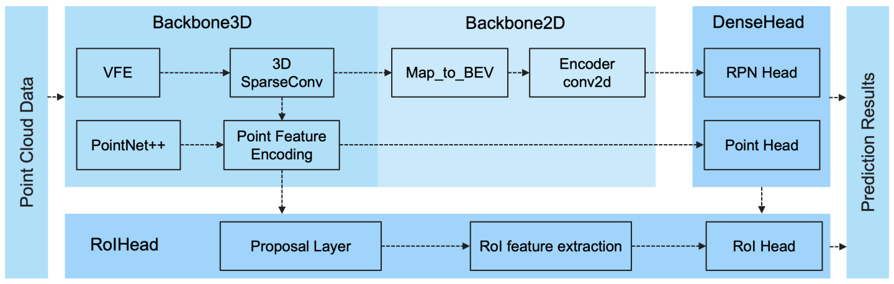

# RM3D

Official Repo of the Project - RM3D: Robust Data-Efficient 3D Scene Parsing via Traditional and Learnt 3D Descriptors-based Semantic Region Merging

# 3D Detection 

Our codebase of 3D object detection is based on OpenPCDet.

`OpenPCDet` is a clear, simple, self-contained open source project for LiDAR-based 3D object detection. 

It is also the official code release of [`[PointRCNN]`](https://arxiv.org/abs/1812.04244), [`[Part-A^2 net]`](https://arxiv.org/abs/1907.03670), [`[PV-RCNN]`](https://arxiv.org/abs/1912.13192) and [`[Voxel R-CNN]`](https://arxiv.org/abs/2012.15712). 

## Overview
- [Changelog](#changelog)
- [Design Pattern](#openpcdet-design-pattern)
- [Model Zoo](#model-zoo)
- [Installation](docs/INSTALL.md)
- [Quick Demo](docs/DEMO.md)
- [Getting Started](docs/GETTING_STARTED.md)

### `OpenPCDet` design pattern

* Data-Model separation with unified point cloud coordinate for easily extending to custom datasets:

  

* Unified 3D box definition: (x, y, z, dx, dy, dz, heading).

* Flexible and clear model structure to easily support various 3D detection models: 

  

* Support various models within one framework as: 

  

### Currently Supported Features

- [x] Support both one-stage and two-stage 3D object detection frameworks
- [x] Support distributed training & testing with multiple GPUs and multiple machines
- [x] Support multiple heads on different scales to detect different classes
- [x] Support stacked version set abstraction to encode various number of points in different scenes
- [x] Support Adaptive Training Sample Selection (ATSS) for target assignment
- [x] Support RoI-aware point cloud pooling & RoI-grid point cloud pooling
- [x] Support GPU version 3D IoU calculation and rotated NMS 

## Model Zoo

### KITTI 3D Object Detection Baselines

Selected supported methods are shown in the below table. Here we provide the pretrained models which achieves State  the 3D detection performance on the *val* set of KITTI dataset.

* All models are trained with 4 RTX 2080 Ti GPUs and are available for download. 
* The training time is measured with 4 2080 Ti GPUs and PyTorch 1.5.

 Data Efficient Learning with **3% labels**

|                                             | training time | Car@R11 | Pedestrian@R11 | Cyclist@R11  | download | 
|---------------------------------------------|----------:|:-------:|:-------:|:-------:|:---------:|
| [PointPillar](tools/cfgs/kitti_models/pointpillar.yaml) |~2.66 hours| 65.43 | 45.08 | 51.88 | [model_PointPillar](https://entuedu-my.sharepoint.com/:u:/g/personal/kangcheng_liu_staff_main_ntu_edu_sg/EUV1Ez-OTSRFpBBXUwIke0gB7GBTwrkdLSqY-ibt2OU6ww?e=zY8zxC) | 
| [SECOND](tools/cfgs/kitti_models/second.yaml)       |  ~2.75 hours  | 69.56 | 43.29 | 56.66 | [model_SECOND](https://entuedu-my.sharepoint.com/:u:/g/personal/kangcheng_liu_staff_main_ntu_edu_sg/ESYDg3FKpTdKiny4mFCFGgoBYczMVUlSPJ-iX1vHAXzKCQ?e=HvGbN2) |
| [SECOND-IoU](tools/cfgs/kitti_models/second_iou.yaml)       | -  | 68.28 | 45.39 | 57.29 | [model_SECOND-IoU](https://entuedu-my.sharepoint.com/:u:/g/personal/kangcheng_liu_staff_main_ntu_edu_sg/EYBGK0uS5eVKqkjee1PoES8BqSoLxKy50GO9LJQZ-bG8Uw?e=IZlPCM) |
| [PointRCNN](tools/cfgs/kitti_models/pointrcnn.yaml) | ~5.67 hours | 64.70 | 46.62 | 62.16 | [model_PointRCNN](https://entuedu-my.sharepoint.com/:u:/g/personal/kangcheng_liu_staff_main_ntu_edu_sg/EeJKVClJKGxAsAzWzECSgIABD6I2DCYTXw-uufZV8nlLig?e=oCjdo7)| 
| [PointRCNN-IoU](tools/cfgs/kitti_models/pointrcnn_iou.yaml) | ~6.12 hours | 67.54 | 47.19 | 60.25 | [model_PointRCNN-IoU](https://entuedu-my.sharepoint.com/:u:/g/personal/kangcheng_liu_staff_main_ntu_edu_sg/EVIUlrB_s5RKqQv-GV8QuBMBKQt1hrdNs55p06ya-T_V1g?e=la8XK6)|
| [Part-A^2-Free](tools/cfgs/kitti_models/PartA2_free.yaml)   | ~5.98 hours| 65.92 | 57.83 | 63.18 | [model_Part-A^2-Free](https://entuedu-my.sharepoint.com/:u:/g/personal/kangcheng_liu_staff_main_ntu_edu_sg/EbTU3Nn8tO5Ju0orXTsobIsB0N7ayhp8CbzvNwTrtdumMw?e=IsKA7h) |
| [Part-A^2-Anchor](tools/cfgs/kitti_models/PartA2.yaml)    | ~7.87 hours| 69.22 | 50.79 | 58.17 | [model_Part-A^2-Anchor](https://entuedu-my.sharepoint.com/:u:/g/personal/kangcheng_liu_staff_main_ntu_edu_sg/EbE4GB3ZKCNJuHPXgmv2HucB-efcZFy4Brv-LaVtLHdf0A?e=4mlWnP) |
| [PV-RCNN](tools/cfgs/kitti_models/pv_rcnn.yaml) | ~8.78 hours| 74.24 | 47.65 | 60.23 | [model_PV-RCNN](https://entuedu-my.sharepoint.com/:u:/g/personal/kangcheng_liu_staff_main_ntu_edu_sg/EeNl-cetTAFMtVKdTOsz8k4BB8SIMM4lSz5MuoAz17sPmA?e=bgFMTP) |
| [Voxel R-CNN (Car)](tools/cfgs/kitti_models/voxel_rcnn_car.yaml) | ~3.87 hours| 76.23 | - | - | [model_Voxel_R-CNN](https://entuedu-my.sharepoint.com/:u:/g/personal/kangcheng_liu_staff_main_ntu_edu_sg/EZglvLTaWw1GgPNZDpn886YBA8yxGzc4RC7O6H9yj_qtlA?e=7N3Q0W) |
| [CaDDN](tools/cfgs/kitti_models/CaDDN.yaml) |~19.83 hours| 19.34 | 11.86 | 8.17 | [model_CaDDN](https://entuedu-my.sharepoint.com/:u:/g/personal/kangcheng_liu_staff_main_ntu_edu_sg/ERRy-eooq4VNtzmmPwfxFowB-GgLICYCX7ZbGWDVK92prg?e=4dDm8r) |

### Waymo Open Dataset Baselines

We provide the setting of [`DATA_CONFIG.SAMPLED_INTERVAL`](tools/cfgs/dataset_configs/waymo_dataset.yaml) on the Waymo Open Dataset (WOD) to subsample partial samples for training and evaluation, 
so you could also play with WOD by setting a smaller `DATA_CONFIG.SAMPLED_INTERVAL` even if you only have limited GPU resources. 

By default, all models are trained with **3% data (~4.8k frames)** of all the training samples on 4 2080 Ti GPUs, and the results of each cell here are mAP/mAPH calculated by the official Waymo evaluation metrics on the **whole** validation set (version 1.2).    

|                                             | Vec_L1 | Vec_L2 | Ped_L1 | Ped_L2 | Cyc_L1 | Cyc_L2 |  
|---------------------------------------------|----------:|:-------:|:-------:|:-------:|:-------:|:-------:|
| [SECOND](tools/cfgs/waymo_models/second.yaml) | 57.15/66.38	| 49.42/48.67 | 50.75/40.39	| 42.18/36.65 | 47.65/43.98 | 41.22/40.92 | 
| [Part-A^2-Anchor](tools/cfgs/waymo_models/PartA2.yaml) | 59.82/58.29 | 53.33/52.82 | 52.15/44.76 | 45.12/40.29 | 56.67/55.21 | 50.29/50.88 |
| [PV-RCNN](tools/cfgs/waymo_models/pv_rcnn.yaml) | 59.06/55.38 | 55.67/63.38 |	54.23/43.76 | 44.89/38.28 |	53.15/50.94	| 49.87/48.69 | 

We could not provide the above pretrained models due to [Waymo Dataset License Agreement](https://waymo.com/open/terms/), you could easily achieve similar performance by training with the default configs.

### Other datasets
More datasets are on the way. 

## Installation

Please refer to [INSTALL.md](docs/INSTALL.md) for the installation of `OpenPCDet`.

## Quick Demo
Please refer to [DEMO.md](docs/DEMO.md) for a quick demo to test with a pretrained model and 
visualize the predicted results on your custom data or the original KITTI data.

## Getting Started

Please refer to [GETTING_STARTED.md](docs/GETTING_STARTED.md) to learn more usage about this project.

## License

`OpenPCDet` is released under the [Apache 2.0 license](LICENSE).

## Contribution

For Questions regarding the 3D object detction code of our RM3D Please contact email (kcliuntu@gmail.com or kcliu@gmail.com). 

# If you find our work helpful, please feel free to give a star to this repo!

