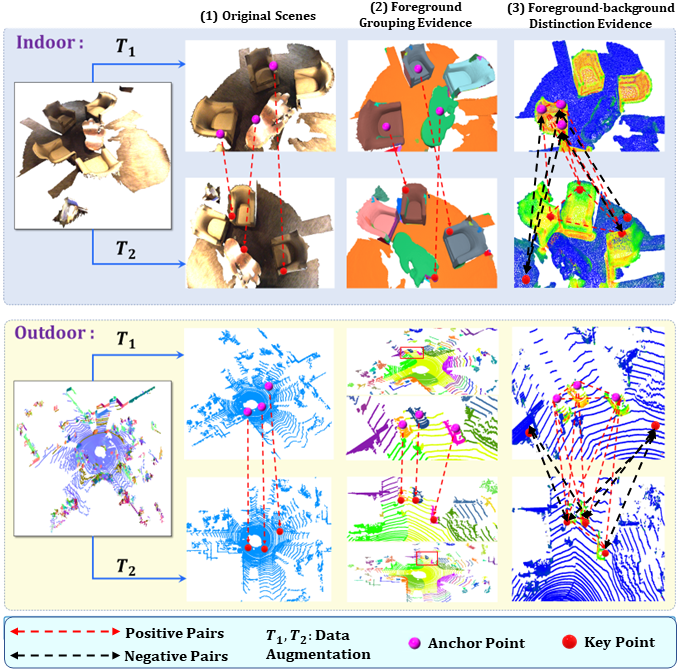
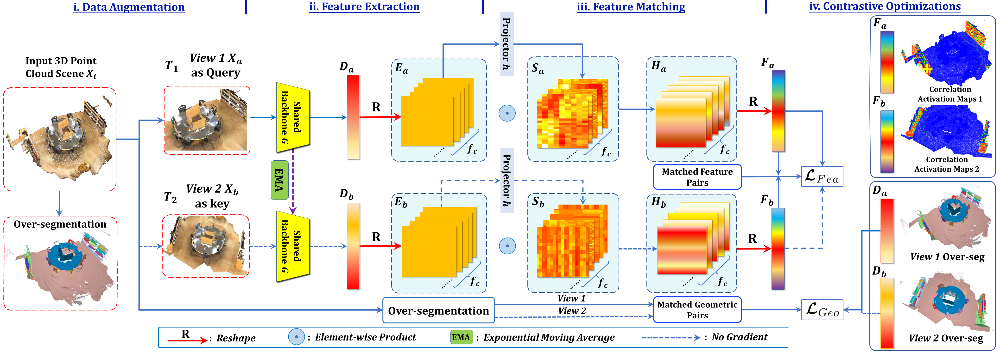
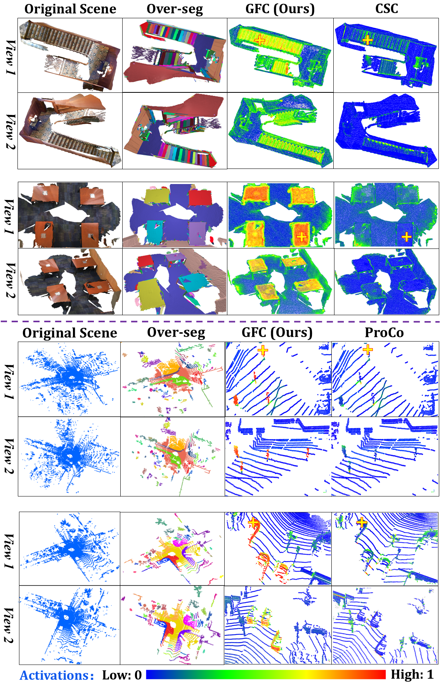

# FAC

Official Repo of the Project - FAC: 3D Pretraining via Foreground Aware Feature Contrast

# Introduction of this work

<p align="center">  </p>

Constructing informative contrast pairs matters in contrastive learning: Conventional contrast requires strict point-level correspondence. The proposed method FAC takes both foreground grouping and foreground-background distinction cues into account, thus forming better contrast pairs to learn more informative and discriminative 3D feature representations.

# The framework illustration

<p align="center">  </p>

The framework of this work is illustrated above, basically we construct better contrast pairs for more informative constrative feature learning to enhance downstream performance. In other words, grouping and foreground-background distinction for better contrastive feature learning.


# The activation visualization

<p align="center">  </p>

Visualizations of projected point correlation maps over the indoor ScanNet (1st-4th rows) and the outdoor KITTI (5th-8th rows) with respect to the query points highlighted by yellow crosses. The View 1 and View 2 in each sample show the intra-view and cross-view correlations, respectively. We compare FAC with the state-of-the-art CSC on instance segmentation (rows 1-4) and ProposalContrast on detection (rows 5-8). FAC clearly captures better feature correlations within and across views (columns 3-4).


## Abstract of this work

 This work presents a general and simple framework to tackle 3D point cloud pre-training for the base model of the downstream detection and segmentation tasks. Contrastive learning has recently demonstrated great potential for unsupervised pre-training in 3D scene understanding tasks. However, most existing work randomly selects point features as anchors while building contrast, leading to a clear bias toward background points that often dominate in 3D scenes. Also, object awareness and foreground-to-background discrimination are neglected, making contrastive learning less effective. To tackle these issues, we propose a general foreground-aware feature contrast (FAC) framework to learn more effective point cloud representations in pre-training. FAC consists of two novel contrast designs to construct more effective and informative contrast pairs. The first is building positive pairs within the same foreground segment where points tend to have the same semantics. The second is that we prevent over-discrimination between 3D segments/objects and encourage foreground-to-background distinctions at the segment level with adaptive feature learning in a Siamese correspondence network, which adaptively learns feature correlations within and across point cloud views effectively. Visualization with point activation maps shows that our contrast pairs capture clear correspondences among foreground regions during pre-training. Quantitative experiments also show that FAC achieves superior knowledge transfer and data efficiency in various downstream 3D semantic segmentation and object detection tasks.

## Navigation

For the task of 3D Object Detection, please refer to [FAC_Det](OpenPCDet/README.md).

For the task of 3D Semantic Segmentation, please refer to [FAC_Sem_Seg](FAC_Conv/README.md).

For the task of 3D Instance Segmentation, please refer to [FAC_Ins_Seg](FAC_Ins/README.md).

For the pre-training setup in detection and segmentation, please refer to [Downstreams](Downstreams/README.md).

## Installation

Please refer to [INSTALL.md](OpenPCDet/docs/INSTALL.md) for the installation of `OpenPCDet`.

# 3D Detection 

Our codebase of 3D object detection is based on OpenPCDet.

`OpenPCDet` is a clear, simple, self-contained open source project for LiDAR-based 3D object detection. 

It is also the official code release of [`[PointRCNN]`](https://arxiv.org/abs/1812.04244), [`[Part-A^2 net]`](https://arxiv.org/abs/1907.03670), [`[PV-RCNN]`](https://arxiv.org/abs/1912.13192) and [`[Voxel R-CNN]`](https://arxiv.org/abs/2012.15712). 


## Overview
- [Changelog](#changelog)
- [Design Pattern](#openpcdet-design-pattern)
- [Model Zoo](#model-zoo)
- [Installation](OpenPCDet/docs/INSTALL.md)
- [Quick Demo](OpenPCDet/docs/DEMO.md)
- [Getting Started](OpenPCDet/docs/GETTING_STARTED.md)


### Currently Supported Features

- [x] Support both one-stage and two-stage 3D object detection frameworks
- [x] Support distributed training & testing with multiple GPUs and multiple machines
- [x] Support multiple heads on different scales to detect different classes
- [x] Support stacked version set abstraction to encode various number of points in different scenes
- [x] Support Adaptive Training Sample Selection (ATSS) for target assignment
- [x] Support RoI-aware point cloud pooling & RoI-grid point cloud pooling
- [x] Support GPU version 3D IoU calculation and rotated NMS 


## Model Zoo


### KITTI 3D Object Detection Baselines


Selected supported methods are shown in the below table. Here we provide the pretrained models which achieves State of the art 3D detection performance on the *val* set of KITTI dataset.


* All models are trained with 4 RTX 2080 Ti GPUs and are available for download. 
* The training time is measured with 4 2080 Ti GPUs and PyTorch 1.5.

 Data Efficient Learning with **3% labels**

|                                             | training time | Car@R11 | Pedestrian@R11 | Cyclist@R11  | download | 
|---------------------------------------------|----------:|:-------:|:-------:|:-------:|:---------:|
| [PointPillar](tools/cfgs/kitti_models/pointpillar.yaml) |~2.66 hours| 66.57 | 46.28 | 52.89 | [model_PointPillar](https://hkustgz-my.sharepoint.com/:u:/g/personal/kangchengliu_hkust-gz_edu_cn/EdoXdskw0hNEnqOOtBm-afUBqg-AiR79BJjHJL7sNinihQ?e=RNOJoK) | 
| [SECOND](tools/cfgs/kitti_models/second.yaml)       |  ~2.75 hours  | 69.92 | 43.86 | 56.98 | [model_SECOND](https://hkustgz-my.sharepoint.com/:u:/g/personal/kangchengliu_hkust-gz_edu_cn/EQjQKcHFSzJBhu9-Hq0mgWYBOHgMlhTNPUyH8WDBEQihsg?e=XDMxft) |
| [SECOND-IoU](tools/cfgs/kitti_models/second_iou.yaml)       | -  | 68.76 | 45.74 | 57.88 | [model_SECOND-IoU](https://hkustgz-my.sharepoint.com/:u:/g/personal/kangchengliu_hkust-gz_edu_cn/ET9cwnHSC6ZFscvg-zqz6B4BpV1HMhAydhtO35wI_QxLtA?e=XeIexn) |
| [PointRCNN](tools/cfgs/kitti_models/pointrcnn.yaml) | ~5.67 hours | 64.91 | 46.89 | 62.73 | [model_PointRCNN](https://hkustgz-my.sharepoint.com/:u:/g/personal/kangchengliu_hkust-gz_edu_cn/EbP_V4FeU69OnpBGWv-fZpUBQ-SnVKfsHeCsWfMiF7sraQ?e=hvC57x)| 
| [PointRCNN-IoU](tools/cfgs/kitti_models/pointrcnn_iou.yaml) | ~6.12 hours | 67.81 | 47.28 | 60.65 | [model_PointRCNN-IoU](https://hkustgz-my.sharepoint.com/:u:/g/personal/kangchengliu_hkust-gz_edu_cn/EVBfkPhvtCVHkf_Bf_T7Lo8BQ4VHQbpuKgtBiTZuuh0m6g?e=wShlth)|
| [Part-A^2-Free](tools/cfgs/kitti_models/PartA2_free.yaml)   | ~5.98 hours| 66.56 | 58.26 | 63.87 | [model_Part-A^2-Free](https://hkustgz-my.sharepoint.com/:u:/g/personal/kangchengliu_hkust-gz_edu_cn/Ed6Hsw_nbydGmoYUcgWxJ18B0rof0TRxa8yUgF3AdlNERQ?e=yTKGZf) |
| [Part-A^2-Anchor](tools/cfgs/kitti_models/PartA2.yaml)    | ~7.87 hours| 68.87 | 51.22 | 57.89 | [model_Part-A^2-Anchor](https://hkustgz-my.sharepoint.com/:u:/g/personal/kangchengliu_hkust-gz_edu_cn/EYnMbUtsIyNDhISA1B_y64MBESYwBDMXHCcGMW9rRj-Z2Q?e=XfUvAO) |
| [PV-RCNN](tools/cfgs/kitti_models/pv_rcnn.yaml) | ~8.78 hours| 75.12 | 47.32 | 59.98 | [model_PV-RCNN](https://hkustgz-my.sharepoint.com/:u:/g/personal/kangchengliu_hkust-gz_edu_cn/ERBLfMN-h5ZIget1AnDzfZsB5pRdb0VT3LC5JZVTD-1-lQ?e=dkToyy) |
| [Voxel R-CNN (Car)](tools/cfgs/kitti_models/voxel_rcnn_car.yaml) | ~3.87 hours| 75.87 | - | - | [model_Voxel_R-CNN](https://hkustgz-my.sharepoint.com/:u:/g/personal/kangchengliu_hkust-gz_edu_cn/EfgNgRs5me1FidF4KfzGvzkB_xxbuM55yBYywChRQ3fyMQ?e=a44vyy) |
| [CaDDN](tools/cfgs/kitti_models/CaDDN.yaml) |~19.83 hours| 19.21 | 11.23 | 9.09 | [model_CaDDN](https://hkustgz-my.sharepoint.com/:u:/g/personal/kangchengliu_hkust-gz_edu_cn/EbS77nwadmVPjz9KPwcTsEAB87PTpWPt9L_XCpQog4gPPA?e=7Yra6s) |


### Waymo Open Dataset Baselines

We provide the setting of [`DATA_CONFIG.SAMPLED_INTERVAL`](tools/cfgs/dataset_configs/waymo_dataset.yaml) on the Waymo Open Dataset (WOD) to subsample partial samples for training and evaluation, 
so you could also play with WOD by setting a smaller `DATA_CONFIG.SAMPLED_INTERVAL` even if you only have limited GPU resources. 

By default, all models are trained with **3% data (~4.8k frames)** of all the training samples on 4 2080 Ti GPUs, and the results of each cell here are mAP/mAPH calculated by the official Waymo evaluation metrics on the **whole** validation set (version 1.2).    

|                                             | Vec_L1 | Vec_L2 | Ped_L1 | Ped_L2 | Cyc_L1 | Cyc_L2 |  
|---------------------------------------------|----------:|:-------:|:-------:|:-------:|:-------:|:-------:|
| [SECOND](tools/cfgs/waymo_models/second.yaml) | 57.15/66.38	| 49.99/48.79 | 51.65/42.65	| 41.64/36.64 | 47.12/45.22 | 42.65/42.64 | 
| [Part-A^2-Anchor](tools/cfgs/waymo_models/PartA2.yaml) | 60.33/59.12 | 54.77/53.18 | 53.65/43.87 | 44.43/39.65 | 55.86/54.65 | 51.54/51.77 |
| [PV-RCNN](tools/cfgs/waymo_models/pv_rcnn.yaml) | 59.06/55.38 | 55.67/63.38 |	54.23/43.76 | 44.89/38.28 |	53.15/50.94	| 49.87/48.69 | 

We could not provide the above pretrained models due to [Waymo Dataset License Agreement](https://waymo.com/open/terms/), 
you could easily achieve similar performance by training with the default configs.


### Other datasets
More datasets are on the way. 


## Installation

Please refer to [INSTALL.md](OpenPCDet/docs/INSTALL.md) for the installation of `OpenPCDet`.


## Quick Demo
Please refer to [DEMO.md](OpenPCDet/docs/DEMO.md) for a quick demo to test with a pretrained model and 
visualize the predicted results on your custom data or the original KITTI data.

## Getting Started

Please refer to [GETTING_STARTED.md](OpenPCDet/docs/GETTING_STARTED.md) to learn more usage about this project.


## License

The `FAC` is released under the [MIT license](LICENSE).

<!-- ## Other -->


## Contact

For Questions regarding the 3D point cloud smenatic segmentation, 3D instance segmentation, and 3D object detction, and the methodology of our FAC-(Foreground_Aware_Contrast), please contact through email (kcliuntu@gmail.com or kcliu@gmail.com). 

## Citation

Please cite our work if you find our work useful:


```
@article{liu2023fac,
  title={FAC: 3D Representation Learning via Foreground Aware Feature Contrast},
  author={Liu, Kangcheng and Xiao, Aoran and Zhang, Xiaoqin and Lu, Shijian and Shao, Ling},
  journal={arXiv preprint},
  year={2023}
}
```

## Star

If you find our work helpful, please feel free to give a star to this repo.


